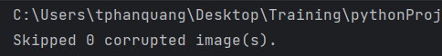
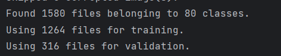
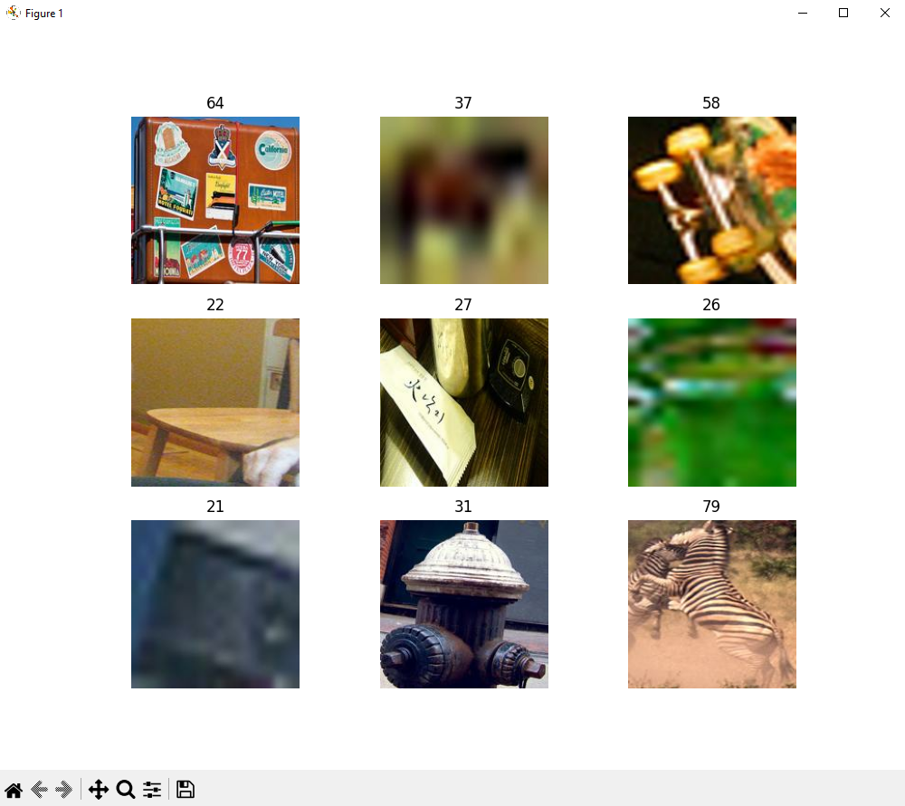
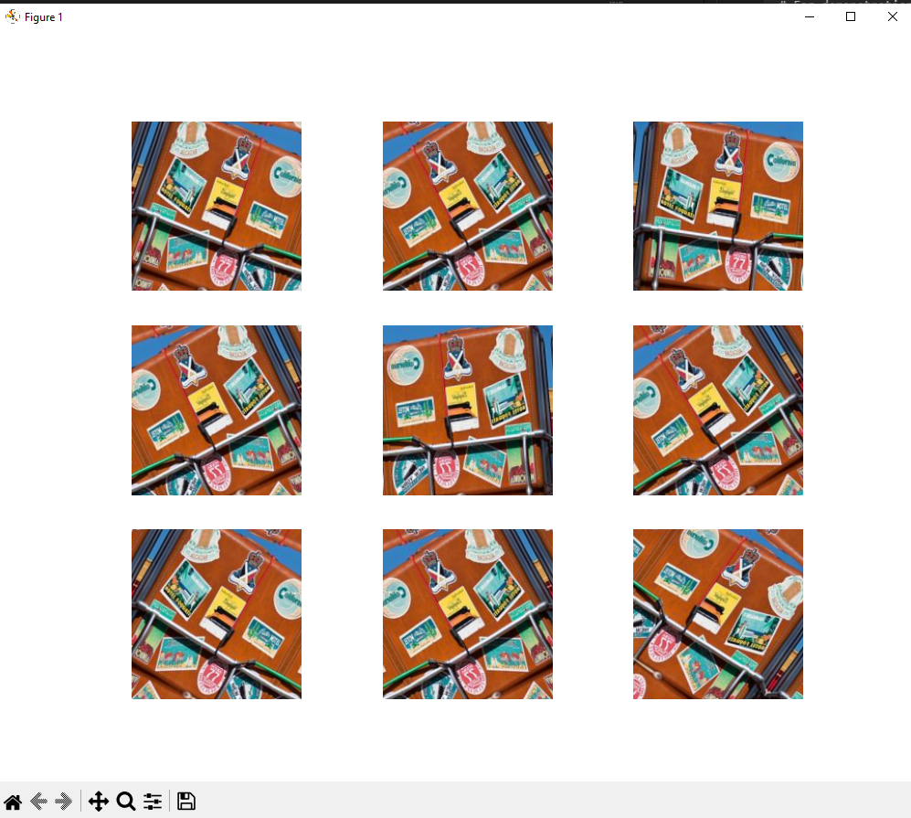
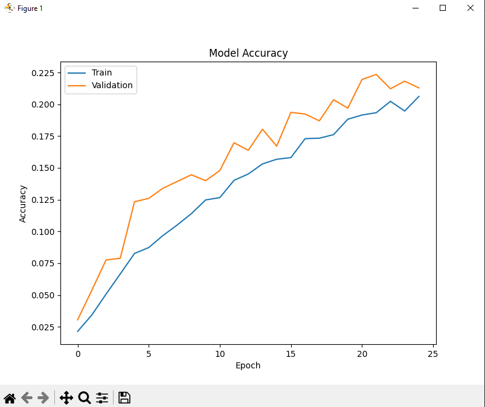

# Lab 2 : Build your first model

This lab focuses on preparing the COCO dataset for model training and building a deep learning model for object classification. The COCO dataset is a widely used benchmark dataset in computer vision, providing labeled images for various tasks.

The lab consists of two main parts: preprocessing and model building. In the preprocessing part, participants will learn about loading the split datasets, performing image resizing, normalization, and annotation conversion. These preprocessing steps are essential for preparing the dataset for model input.

## Preprocess 

To make it easer, first we are going to transform all of our data to 180 x 180
This is easy, so go a head and do it

When working with lots of real-world image data, corrupted images are a common occurence. Let's filter out badly-encoded images that do not feature the string "JFIF" in their header.

hint :
```
    image_object = open(path, "rb")
    is_jfif = tf.compat.as_bytes("JFIF") in fobj.peek(10)
    
    if not is_jfif:
        # corrupted , just deleted it
```
out put:


next step we gonna generate a dataset. Luckily, tf already give us a high level api for this discover it [yourself](https://www.tensorflow.org/api_docs/python/tf/keras/utils/image_dataset_from_directory) 

This func is very helpfull as it even do the data spiliting ad suffelling for us, remember to give the param seed thought. Use it and set __validation_split=0.2__ (why 0.2, figure it out your self)

Save the out put to 
```
train_ds, val_ds = ....
```


and try to see what the ds is
```
# For demonstration, iterate over the batches yielded by the dataset.
for data, labels in dataset:
   print(data.shape)  
   print(data.dtype)  # float32
   print(labels.shape) 
   print(labels.dtype)  # int32
```

The label of a sample is the rank of its folder in alphanumeric order. Naturally, this can also be configured explicitly by passing, e.g. class_names=['class_a', 'class_b'], in which cases label 0 will be class_a and 1 will be class_b.



Data generation is also need if u are using a small data set, some method include random flipping, or random rotation. the tf lib also give us some func to make it simpler
```
    layers.RandomFlip("horizontal"),
    layers.RandomRotation(0.1),
```

mess a round with it and see how to apply it to your data set

## Build a simple CNN
By this step, assume u have some general knowledge of deeplearning and cnn already, we gonna buld a simple model and train it
This is my sample model architecture, u can follow me all come up with whatever u like, w gonna fix that later
(try to read about cov layer, or pooling ... before hand)
```
Input Shape: (None, 180, 180, 3)

--- Layer 1 ---
- Conv2D: filters=32, kernel_size=(3, 3), padding="same"
Output Shape: (None, 180, 180, 32)

- MaxPooling2D: pool_size=(2, 2)
Output Shape: (None, 90, 90, 32)

--- Layer 2 ---
- Conv2D: filters=64, kernel_size=(3, 3), padding="same"
Output Shape: (None, 90, 90, 64)

- MaxPooling2D: pool_size=(2, 2)
Output Shape: (None, 45, 45, 64)

--- Layer 3 ---
- Conv2D: filters=128, kernel_size=(3, 3), padding="same"
Output Shape: (None, 45, 45, 128)

- MaxPooling2D: pool_size=(2, 2)
Output Shape: (None, 22, 22, 128)

--- Layer 4 ---
- Flatten
Output Shape: (None, 22 * 22 * 128) = (None, 61952)

--- Layer 5 ---
- Dense: units=128, activation='relu'
Output Shape: (None, 128)

--- Layer 6 ---
- Dropout: rate=0.5
Output Shape: (None, 128)

--- Output Layer ---
- Dense: units=num_classes, activation='softmax'
Output Shape: (None, num_classes)
```

hint: 
```
def make_model(input_shape, num_classes):
    inputs = keras.Input(shape=input_shape)
    x = layers.Rescaling(1.0 / 255)(inputs)
    x = layers.Conv2D(..)(x)
    ...
    outputs = layers.Dense(num_classes, activation='softmax')(x)

    return keras.Model(inputs, outputs)

```


and then compile and train with __model.fit(..)__
```
    optimizer=keras.optimizers.Adam(1e-3),
    loss="sparse_categorical_crossentropy",
    epochs = 25
```


Well, congratulation on training your first model, it still perform like shit thought. However, after 25 epoch it have 22.5% change of gessing the correct class among 80 classes. And we can see it learning curve. In the next lab, we gonna optimize it